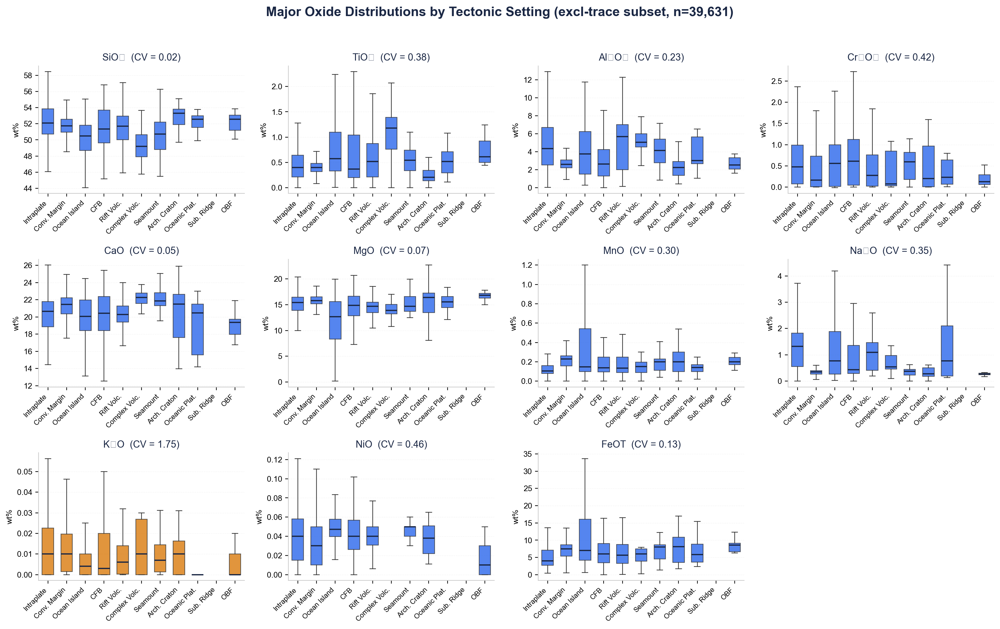
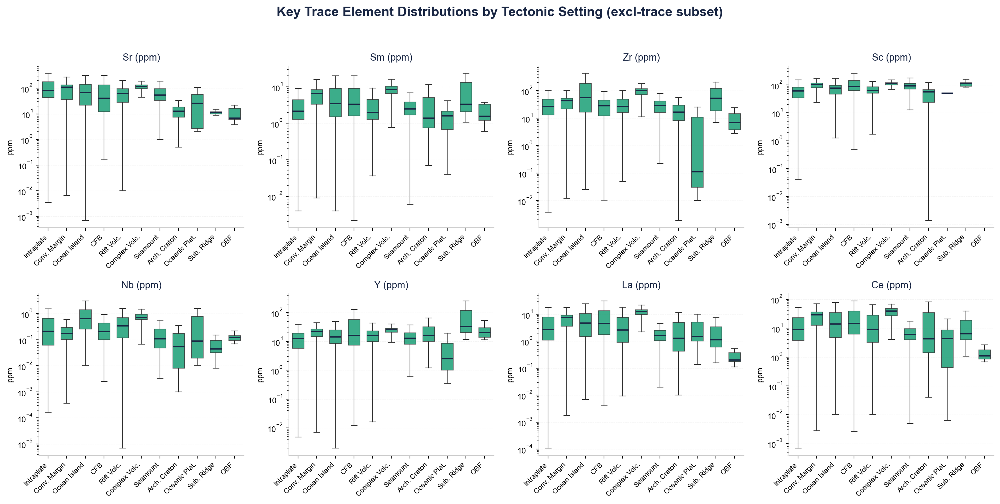
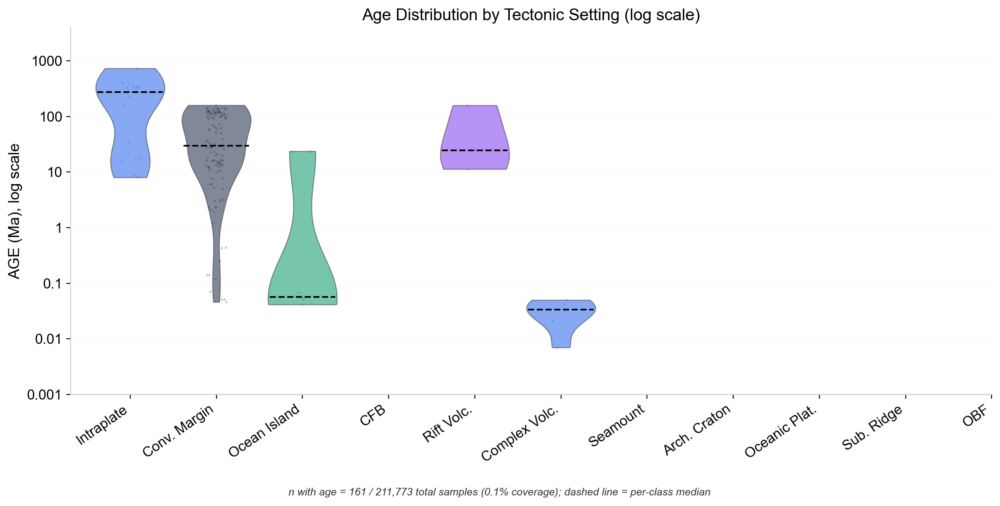
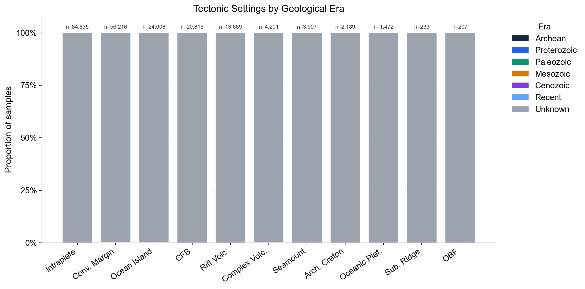

# 单斜辉石构造环境判别项目 · 综合综述

## 引言

本项目在 GEOROC 全球单斜辉石数据库上训练了一个可以把 11 种构造环境直接区分开的多分类模型，最终在 39,631 条样本、50 个特征上得到 **F1-macro = 0.909 ± 0.005，Accuracy = 0.953 ± 0.002**（五折分层交叉验证）。在单斜辉石这个矿物尺度上把构造环境直接端到端分出来，是一个近年被多次尝试、但此前未见公开发表过大规模稳态结果的问题。本文档从 5 个层面依次讲清楚：(1) 原始元数据到底长什么样；(2) 它在空间和时间维度上的覆盖；(3) 这个多分类任务背后的训练与解释原理；(4) 我们跑过的子集实验和它们的对照关系；(5) 真正值得深入看的结果与解释。建议读者按顺序从头读到尾，读完再回到任何一节去钻具体产物。

---

## 1. 原数据的元数据分布

项目的原始输入来自 GEOROC / GRO.data（DOI: 10.25625/SGFTFN），即 `clinopyroxene_data.tab`——文件后缀写着 `.tab`，实际却是逗号分隔、拉丁编码（`encoding='latin-1'`）的 CSV，这是所有后续清洗脚本都必须接受的一个小陷阱。原表共 **216,952 行 × 451 列**，在删掉 `TECTONIC SETTING` 为空的行之后剩下 **211,773** 行，这就是项目其它所有统计的分母。

451 列里真正和地球化学直接相关的只是一小部分，其余是大量的采样元数据、来源文献、实验条件、以及重复列。最扎眼的问题是铁列：同一行可能出现 `FEOT`、`FEO`、`FE2O3T`、`FE2O3` 中的两到三种，单位和氧化态各不相同。对任何懂一点岩石学的人这一看就知道不能直接加总——`FE2O3` 是三价铁的氧化物，`FEO` 是二价铁的氧化物，`FEOT` 是"全部铁折算到二价"的总量，三者之间有化学计量转换关系而不是相加关系。`01_clean_data.py` 的 Fe 合并逻辑按"优先使用 FEOT / 其次由 FEO + FE2O3 × 0.8998 折算 / 再其次由 FE2O3T × 0.8998 折算"的顺序统一到一列 `FEOT_CALC`，这是整个主量氧化物体系能够作为一个稳定的 11 维向量传进模型的前提，也是后续所有统计可以被别人复现的前提。

另一个必须面对的事实是 **类别极度不均衡**。11 个构造环境里，最多的 INTRAPLATE VOLCANICS 有 84,835 行，最少的 OCEAN-BASIN FLOOD BASALT 只有 207 行，不均衡比 **409.8 : 1**。这个数字决定了后面所有方法论选择——类权重、分层 CV、F1-macro 作为主指标——都不是可有可无的点缀，而是必须的抵消手段。

更棘手的是 **缺失结构**：没有一行样本同时拥有完整的 11 个主量氧化物；81% 的行（172,142 条）**所有 32 个微量元素全部缺失**。这意味着我们不能假定"补一补就行了"，缺失本身是一种系统性的信号，这也是后面第 4 节里那个决定性子集策略的出发点。

`02_eda.py` 在早期完成了基本的汇总统计，但它没有做"按类别逐特征分布"的对比，这是一直以来的盲点。新写的 `17_class_feature_boxplot.py` 补上了这一块，产出了两张关键图：

这两张箱线图上可以直接用肉眼读出哪些特征天然带有强区分力。我们在 `web/data/viz_data.json` 里进一步计算了"类均值的变异系数"（CV-of-class-means，$CV = \sigma_{\bar x_c} / |\overline{\bar x_c}|$），用它当作一种模型无关的统计判别力指标。这个量的直观意思是："如果我只知道一个样本的某一个特征，它在 11 个类均值之间能跳多远？"CV 越大，这个特征把类之间推得越开。排在第一位的是 **K₂O，CV = 1.7527**。这并不是传统单斜辉石岩石学里常挂在嘴边的判别元素——经典的构造判别图通常用 Ti、Cr、Ca/Na 之类的比值——但它在类间均值差异上最大，提示着含碱度在"构造环境⇄单斜辉石化学"这条链上可能是一个被地质学家长期低估的指针。这个"统计领先但传统未被重视"的张力，也是后面第 5 节 K₂O 悖论的起点。

---

## 2. 时空分布

### 空间

在空间上，数据是"全球、真正意义上全球"：211,773 个点的经纬度完整地落在 `web/data/geo_all.json` 里，按 11 类构造环境分组。其中进入最终模型的 39,631 个样本的 OOF 预测和置信度、误分类上下文（LOCATION、ROCK NAME）又单独序列化到 `web/data/prediction_map.json`。`web/index.html` 是一个基于 Leaflet 的交互地图，可以直接在浏览器里打开，按类别切换、按置信度过滤、点开任意点查看元数据。这是目前项目最直观的"从模型回看地质"入口。

一个细节值得记录：坐标字段我们只用了 `LATITUDE (MIN.)` 和 `LONGITUDE (MIN.)`，没有用 MAX 构成的矩形范围。GEOROC 原表里一部分样本给出的是"采样区域"而不是"采样点"，用 MIN 和 MAX 共同界定一个矩形；对大多数样本 MIN 和 MAX 是同一个点，但对少量给出区间的样本我们舍弃了范围信息——这是一个已知的、可以后续扩展的简化。目前这个简化对可视化没有明显影响，但如果将来要做空间自相关或者用坐标作为特征，就需要把矩形范围退化成中心点或者扩展成区域权重。

### 时间 —— 一个必须摆到桌面上的盲点

和空间覆盖形成强烈反差的是，**时间维度几乎是空的**。我们在 `16_age_eda.py` 里系统地检查了 `AGE(MA)` 和 `AGE(KA)` 两列，把 KA 折算成 MA 之后合并，得到的结论是：211,773 条样本里只有 **161 条（0.076%）有任何年龄元数据**。

更令人意外的是分布：**11 个类里有 6 个类的年龄样本数是零**——CONTINENTAL FLOOD BASALT、SEAMOUNT、ARCHEAN CRATON、OCEANIC PLATEAU、SUBMARINE RIDGE、OCEAN-BASIN FLOOD BASALT。其中 ARCHEAN CRATON 按定义本来就是由"古老年龄"定义的构造环境，却 0 条样本带年龄元数据，这是一种很有讽刺意味的数据损失。剩下的 161 条里，CONVERGENT MARGIN 一个类就贡献了 125 条；INTRAPLATE VOLCANICS 的 16 条样本中位年龄是 274.6 Ma。详细分布在 `web/data/age_distribution.json`，可视化产物在 `reports/age_violin.png` 和 `reports/age_era_stacked.png`：

这个发现的含义非常直接：**在当前的数据发布里，年龄既不能作为模型特征，也不能用于分层抽样或时间外延验证**。这不是一个"分布偏斜"可以靠重采样修的统计问题，而是一个"数据根本不在那里"的溯源问题——重采样、插值、甚至先验建模都无济于事，因为 0.076% 的样本量不足以去学"年龄到底影响了什么"。作为项目的一个独立建议，我们应该把这一发现反馈给 GEOROC 的数据维护方，推动他们补齐 `AGE(MA)` 字段——这是项目后续所有"时间演化"类问题（例如"太古代克拉通的单斜辉石化学是否与显生宙克拉通内部岩浆有系统差异"）的瓶颈。从 ML 的角度，这也是一个干净的例子：模型性能的天花板有时不在模型本身，也不在"数据量"这个一维指标，而在"哪一维的元数据被上游记录得多不多"这种细节上。

---

## 3. 多分类任务原理

方法论的完整推导（包括 softmax 损失、梯度 Boosting 的一阶/二阶近似、SHAP 的路径展开）写在 `docs/methodology.md` 里。这一节只做一次高层的导览，目的是让读者知道最终模型每个关键选择为什么是这样。

**目标函数和多类输出**。我们用的是 XGBoost 的 multi-softmax 目标，损失为 multi-class log-loss。每一轮 Boosting 不是长一棵树而是长 K 棵树（K = 11 类），每棵树负责一类 logit，最后一个 softmax 把 K 个 logit 转成类别概率。这是"一 vs 其余"和"原生多类"之间的一种折中，比把 K 个二分类器独立训练更有效地共享底层结构。

**类平衡**。我们用样本权重 $w_i = N / (K \cdot n_{y_i})$ 来抵消 409.8 : 1 的不均衡。这个选择和 F1-macro 作为主指标是一致的——两者都假定"每一类都同样重要"。相比之下，加权 F1 或纯 Accuracy 都会让 INTRAPLATE VOLCANICS 的 84,835 条样本压倒其它一切。

**五折分层 CV 与 OOF 聚合**。`10_cv_confusion.py` 的第 118–190 行实现了分层 5 折，关键细节是：混淆矩阵不是在每一折算完之后平均的，而是把所有折里的 OOF 预测拼起来再算一次。这在类别极不平衡时更稳定——小类在单折里的 n 可能只有几十，单折混淆矩阵噪声太大。

**缺失作为结构信号**。整个 pipeline 没有任何 imputation：NaN 直接喂给 XGBoost，由它在每个节点学习"往左还是往右"的缺失方向。这不是懒惰，而是一个有意识的决定——当 81% 的样本所有微量元素都缺失时，"缺失与否"本身就是一个巨强的元特征，任何填充都会把这个信号抹掉。

**SHAP 解释**。`09_shap_analysis.py` 的第 145–211 行用 TreeSHAP 为每个样本、每个类别、每个特征算出一个贡献值。由此得到一个三阶张量 `(n_samples, n_classes, n_features)`，满足 softmax 形式下的零和约束：对任意一个样本，所有 11 类的 SHAP 向量相加恒为零——这是 softmax 多类 SHAP 的一个天然性质，它告诉我们"把样本推向某一类"和"把样本推离其它类"是同一件事的两面。正是这个性质让后面第 5 节我们可以做"Sr 把样本推向 Convergent Margin、同时推离 Archean Craton"这种有方向的解释。全局指标是把绝对值在样本维度上取均值，按类指标则是把有符号值在样本维度上取均值，两者给的信息是互补的。

完整的数学推导请读 `docs/methodology.md`。

---

## 4. 不同子集实验梳理

这一节讲清楚我们为什么最终停在 "excl trace-missing 子集 + 全特征" 这一组配置，以及一路上被证伪的那些中间形态。

最早的探索脚本（编号 03、04、05、06、07、12，以及 `extract_map_data.py` 这个 stub）都已经从仓库里删掉了。它们共同的问题是：在完整的 211,773 行上用中位数/均值对微量元素做填充，然后直接训练。这条路的天花板是 **F1m ≈ 0.73**（中位数填充）到 **0.762**（原生 NaN）。一个粗暴的解释是：当 81% 的样本在微量元素上是 NaN 时，模型被迫把"全缺失"这一种模式和"真有值"的两种模式混在一起学，结果是两边都学不好。

**突破来自一个反直觉的操作**：与其想办法"救回"缺失样本，不如干脆把它们扔掉。`08_train_no_full_trace_missing.py` 做的就是这件事——只保留至少有一个微量元素非空的行，n 从 211,773 降到 **39,631**，F1m 从 0.762 跳到 **0.909 ± 0.005**。样本少了五倍，性能却大幅上升，这是项目最重要的方法论发现之一。从 ML 的教科书角度，这也是一个反"数据越多越好"直觉的案例：当大量样本在关键特征维度上完全缺失时，它们不仅不提供信息，还会让模型不得不花容量去学"缺失模式"这一层噪声，结果是两种样本（全缺 / 有值）的决策面互相拖累。扔掉它们等于把训练分布清理干净了。5 折的 per-fold F1m 是 0.9057、0.9181、0.9103、0.9044、0.9064，方差极小（σ ≈ 0.005），说明这不是侥幸，而是一个稳健的局部最优。

**消融验证**。同样的 39,631 行子集上，只用 11 个主量氧化物重新训练（`13_fill_experiment_gaps.py` 里的 major-only 分支），F1m 掉到 **0.432**。差值 +0.477 证明了一件事：**微量元素是构造环境信号的真正载体**，主量氧化物最多承担了一半的工作量。在玄武岩子集上做同一个消融，差值是 +0.328，同一个方向、量级略小。

**玄武岩与玄武岩斑晶分支**。`11_basalt_subset.py` 把数据限制到玄武岩母岩的样本，大约 46,530 行，F1m = 0.717；叠加 excl trace-missing 后升到 **0.904**（`15_basalt_excl_trace.py`）。更极端的是"玄武岩斑晶 + excl trace-missing"，n 掉到 **783**，F1m 却到了 **0.959**。这几乎是完美分类，但小样本的解释必须谨慎——这个结果究竟是"斑晶环境下单斜辉石化学信号更纯净"还是"小 n 下的过拟合假象"是一个悬而未决的问题，第 6 节列进了下一步待办。

完整的实验对照如下：

| 组 | 子集 | n | F1m | 说明 |
|---|---|---:|---:|---|
| Baseline full, median impute | 全量 | 211,773 | ~0.73 | `viz_data.json` 留档 |
| Full, native NaN | 全量 | 211,773 | 0.762 | 稍好，但仍受 81% 缺失拖累 |
| **Excl trace-missing, 5-fold CV** | **去全缺行** | **39,631** | **0.909 ± 0.005** | **金标准，主结果** |
| Excl trace-missing, major-only | 同上 | 39,631 | 0.432 | 消融证据 |
| Basalt 全量 | 玄武岩 | ~46,530 | 0.717 | 类子集 |
| Basalt + excl trace-missing | 玄武岩去全缺 | — | 0.904 | 同趋势 |
| Basalt 斑晶 + excl trace-missing | 极端子集 | 783 | **0.959** | 近似完美，小 n 警告 |

**仓库当前的脚本版图**（清理后共 11 个 Python 文件）：
- 核心流水线：`01_clean_data.py`、`02_eda.py`、`08_train_no_full_trace_missing.py`、`09_shap_analysis.py`、`10_cv_confusion.py`
- 子集与衍生实验：`11_basalt_subset.py`、`13_fill_experiment_gaps.py`、`14_prediction_map_data.py`、`15_basalt_excl_trace.py`
- 新补的 EDA：`16_age_eda.py`、`17_class_feature_boxplot.py`
- 构建产物：`build_ppt.py`
- 已删除（早期探索、已被取代）：`03`、`04`、`05`、`06`、`07`、`12`、`extract_map_data.py`

---

## 5. 结果分析

### 5.1 每类 F1 分解

单看 0.909 会错过很多结构信息。完整的分类报告在 `web/data/cv_results.json → per_class_metrics`，几个必须知道的事实：

**最难的两类**是 **ARCHEAN CRATON**（F1 = 0.7582，n = 194）和 **OCEANIC PLATEAU**（F1 = 0.816，n = 116）。两者的困难来源一致：样本量极小 **且** 在几何化学空间里与 INTRAPLATE VOLCANICS 高度重叠——混淆矩阵上它们的误分类几乎全部流向 INTRAPLATE VOLCANICS 这一类。对这两类，单纯加权重已经不够，需要数据本身更多。

**最易的类**是 **OCEAN-BASIN FLOOD BASALT**（F1 = 0.9828，n = 59），尽管样本只有 59 条，但它的地球化学特征非常独特，几乎不被任何其它类模仿。这是一个有趣的反例：传统的"小样本 = 学不好"在有强独立信号时并不成立。

**大样本而且分得开**的两类是 **CONVERGENT MARGIN**（F1 = 0.976，n = 14,078）和 **INTRAPLATE VOLCANICS**（F1 = 0.956，n = 16,988）——整个模型性能的底盘主要来自这两类。完整的混淆矩阵在 `web/data/cv_results.json → confusion_matrix`，也渲染在 PPT 第 11 页。

### 5.2 特征重要性：Gain 与 SHAP 的不一致

这是本项目最值得跟 ML 同行讨论的一个现象。XGBoost 原生的 **Gain 排名**里，前几位是 **NiO、Ferrosilite、Zn**——它们都是"晶体化学/结构"维度的特征。而 **SHAP 全局排名**里前几位是 **Sr、Sm、Zr、Sc**——清一色是微量元素。同一个模型、同一份数据，两种重要性排序几乎不重叠。

这不是 bug，是 Gain 和 SHAP 测量的不是同一个东西：
- **Gain** 记录的是训练期每次分裂的损失下降量。早期分裂的特征拿到大量信用，即使它最终只负责一次粗粒度的"把玄武岩和非玄武岩分开"。
- **SHAP** 用的是推理期的 Shapley 分配——对每个样本每个类别，一个特征值相对于期望值到底改变了多少 logit。这更贴近"这个特征在最终决策里真的重要吗"。

换句话说，NiO 和 Ferrosilite 是**结构级**（用于粗切数据），Sr 和 Sm 是**决策级**（用于最终类别判定）。这个双层结构本身就是结果，值得放进论文图里。对 ML 同行还有一个启发：在报告模型解释时，默认只报 Gain 或只报 SHAP 都会丢掉一半信息，两者并排放出来才能看清楚特征的角色分工。

### 5.3 K₂O 的悖论

第 1 节我们看到 K₂O 的类间变异系数是 1.7527，排所有特征第一。但它在 SHAP 全局排名里只是中等偏上。这并不矛盾：K₂O 携带的信号被它的相关特征（Na₂O 和一系列碱金属微量元素）大量吸收了——在 Shapley 的对称分配里，相关特征之间会平分同一块"信息蛋糕"。

换个角度说：**如果你只能测一个元素来做粗分类，K₂O 是最好的选择**；但一旦你把 Na₂O、Rb、Cs 都加上，K₂O 的边际增量就变小了。这是一个同时对"特征选择"和"野外快速判别"都有意义的观察：理论上可以做一个"最小特征集 vs F1m"的 Pareto 前沿分析，告诉岩石学家"你至少要测哪 5 个元素才能达到 0.9 的分类精度"，这是可以直接落在论文里的一节。

### 5.4 混淆矩阵里藏的地质结构

`web/data/cv_results.json → confusion_matrix` 里真正值得盯着看的是非对角项的**不对称性**。ARCHEAN CRATON 被误判成 INTRAPLATE VOLCANICS 的频率远高于反向，OCEANIC PLATEAU 也是。这说明模型把 INTRAPLATE VOLCANICS 当成了一个"默认桶"——当它对一个样本不够自信时，倾向于把它放进这一类。这一方面是因为 INTRAPLATE 本身样本多、先验高，另一方面也暗示三者在单斜辉石化学上确实有实质重叠。PPT 第 11 页把这个矩阵可视化成热图，更直观。

### 5.5 微量元素的决定性

把第 4 节的消融放到这里重讲一遍：全特征 F1m = 0.909，仅用 11 个主量氧化物 F1m = 0.432，差 +0.477。在玄武岩子集上这个差是 +0.328。这两个数字是整个项目最可辩护的地球化学结论：**在单斜辉石上做构造环境判别，微量元素不是锦上添花，而是骨架**。主量氧化物能告诉你"这是玄武岩还是安山岩"，但要回答"这块岩浆来自弧后盆地还是洋岛"这种问题，必须有微量元素。

### 5.6 SHAP 的方向性解释

全局 SHAP 值只告诉我们"Sr 很重要"，但 `web/data/shap_data.json → shap_per_class` 里的按类 SHAP 可以告诉我们"Sr 把样本往哪个类推"。结果里最清晰的一个模式是：**Sr 的贡献为正时，样本被推向 CONVERGENT MARGIN；同时被推离 ARCHEAN CRATON 和 SUBMARINE RIDGE**。这在地质上是完全可解释的——弧后/汇聚边缘岩浆的 Sr 富集来自俯冲板片脱水，而古老克拉通和大洋中脊的单斜辉石恰好是 Sr 亏损的两种情形。

换句话说，模型不仅在数字上好，它的解释方向和我们独立知道的地球化学机制是一致的。这是在 ML 社区以外、对地球化学家最有说服力的一类证据——它把"黑盒分类器拿到高分"翻译成了"模型隐式学会了俯冲带富 Sr 机制"，后者是一个可以在评审意见里经得起推敲的陈述。类似地，Sm 对 Intraplate Volcanics 的正贡献可以关联到地幔柱源区的 LREE 富集，Zr 对 Convergent Margin 的正贡献对应着弧岩浆的锆石饱和与高场强元素亏损这一对标志性特征。这些解释都可以直接从 `shap_per_class` 的热图里读出来，不需要再训练任何新模型。

---

## 下一步建议

1. **推动 GEOROC 补齐年龄字段**。0.076% 的年龄覆盖率是当前数据最大的硬缺口。和数据维护方合作把这一列补完，可以直接开启"时间演化 × 构造环境"这一整类后续研究。这不是一个需要更多模型的问题，是一个需要更多元数据的问题。
2. **针对 ARCHEAN CRATON 和 OCEANIC PLATEAU 小类**尝试数据增强、靶向采样、或半监督利用那些被我们扔掉的"全缺失"样本的空间元数据作为先验。目前这两类是拖累 F1m 的主要因素。
3. **把 F1 = 0.909 的结果整理成论文**。方法论稳（5 折 CV + OOF + 类权 + 原生 NaN），数据量够（39,631 行 / 50 特征 / 11 类），SHAP 方向性解释和独立的地球化学知识吻合——发表条件已经齐全。
4. **玄武岩斑晶小 n 结果的真实性验证**。F1 = 0.959 / n = 783 要么是一个"信号更纯净的小子集"，要么是过拟合。建议用留一类验证、bootstrap 置信区间、或在独立数据源上外测来判别。

---

## 文件索引

### 脚本
- `01_clean_data.py` — 原表清洗、铁列统一成 `FEOT_CALC`
- `02_eda.py` — 早期汇总 EDA（基础统计，不含按类分布）
- `08_train_no_full_trace_missing.py` — 最终主模型（F1m = 0.909 的训练器）
- `09_shap_analysis.py` — TreeSHAP 解释，输出 3D 张量
- `10_cv_confusion.py` — 5 折分层 CV 与 OOF 混淆矩阵
- `11_basalt_subset.py` — 玄武岩母岩子集实验
- `13_fill_experiment_gaps.py` — 填充策略与 major-only 消融
- `14_prediction_map_data.py` — 构建地图用的预测 JSON
- `15_basalt_excl_trace.py` — 玄武岩 + excl-trace 组合
- `16_age_eda.py` — 年龄覆盖率溯源
- `17_class_feature_boxplot.py` — 按类别的箱线图生成
- `build_ppt.py` — 汇报 PPT 构建脚本

### 数据 JSON（`web/data/`）
- `cv_results.json` — 折分数、每类指标、混淆矩阵
- `shap_data.json` — SHAP 全局 / 按类 / beeswarm
- `viz_data.json` — 类间 CV、类别计数等可视化元数据
- `geo_all.json` — 全量 211,773 个坐标，按类分组
- `prediction_map.json` — 39,631 条 OOF 预测 + 置信度 + 误分类上下文
- `age_distribution.json` — 年龄覆盖率溯源产物
- `basalt_results.json` / `basalt_excl_trace_results.json` — 玄武岩分支实验结果
- `gap_experiments.json` — 填充/消融实验系列
- `samples.json` — UI 用样本采样

### 图件（`reports/`）
- `boxplot_majors.png` — 按类别的主量氧化物分布
- `boxplot_traces.png` — 按类别的微量元素分布
- `age_violin.png` — 年龄小提琴
- `age_era_stacked.png` — 年龄按地质年代分层

### 文档
- `REVIEW.md` — 本文档
- `docs/methodology.md` — 完整数学推导

### 汇报与交互
- `CPX_Tectonic_Classification.pptx` — 16 页汇报 PPT（第 11 页为混淆矩阵）
- `web/index.html` — 基于 Leaflet 的交互地图
- `review_index.html` — 与本综述配套的汇总页（待构建）
